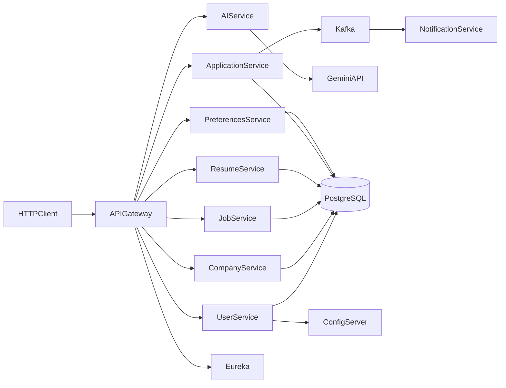

# JobMate Backend

JobMate is a Java 21 job-marketplace backend built as Spring Cloud services. It covers identity, employer companies, job publishing, structured resumes, applications, saved jobs, Gemini-assisted content, and Kafka-driven email notifications.

This repository contains the backend only. It is a portfolio system intended for local evaluation, not a claim of Naukri-scale deployment.

## Architecture



See [Architecture](docs/ARCHITECTURE.md) and [technical decisions](docs/DECISIONS.md) for boundaries and trade-offs.

## Modules

| Path | Responsibility |
|---|---|
| `cloud/job-portal-service-registry` | Eureka service registry |
| `cloud/job-portal-config-server` | Native Spring Cloud Config Server |
| `cloud/job-portal-api-gateway` | Routing and JWT verification |
| `services/job-portal-user-service` | Signup, login, profiles, user administration |
| `services/job-portal-company-service` | Employer-owned company profiles |
| `services/job-portal-job-service` | Jobs, categories, skills, tags, and filtering |
| `services/job-portal-resume-service` | Structured resumes and nested sections |
| `services/job-portal-application-service` | Application lifecycle and employer notes |
| `services/job-portal-preferences` | Saved jobs |
| `services/job-portal-ai-service` | Gemini job, resume, search, and application assistance |
| `services/job-portal-notification-service` | Kafka consumer and SMTP email delivery |
| `common-lib` | Shared DTOs, enums, and event contracts |
| `job-portal-config` | Sanitized local Config Server properties |
| `docker` | PostgreSQL, cloud, and service Compose definitions |

## Stack

- Java 21, Maven, Spring Boot 4.0.5, Spring Cloud 2025.1.1
- Spring MVC Gateway, Eureka, Config Server, OpenFeign
- Spring Security, BCrypt, JJWT
- Spring Data JPA, Hibernate, PostgreSQL 16
- Apache Kafka, JavaMail
- Google Gen AI SDK
- Docker Compose and Jib

## Prerequisites

- JDK 21
- Maven 3.9 or a module Maven wrapper
- Docker Desktop
- A JWT secret of at least 32 bytes
- Optional Gemini API key and SMTP credentials

There is no Maven wrapper at the repository root; wrappers are present inside executable modules.

## Configuration

Copy `docker/.env.example` to `docker/.env` and supply local values:

```dotenv
DB_PASSWORD=
JWT_SECRET=
GEMINI_API_KEY=
MAIL_USERNAME=
MAIL_PASSWORD=
```

Never commit `docker/.env`. Configuration files use environment placeholders and the Config Server reads `job-portal-config/`.

## Local startup

Start PostgreSQL:

```bash
cd docker
docker compose up -d userdb companydb jobdb applicationdb preferencedb resumedb
```

Build the reactor from the repository root:

```bash
mvn clean install
```

Run applications from the IDE or their module wrappers in this order:

1. `job-portal-service-registry`
2. `job-portal-config-server`
3. `job-portal-api-gateway`
4. `job-portal-user-service`
5. Company, job, resume, application, preferences, and AI services
6. Kafka and notification service when testing email events

Set `DB_PASSWORD`, `JWT_SECRET`, and optional integration variables in each process environment. The gateway listens on `5007` when run locally. Docker maps it to `5050`.

| Component | Local port |
|---|---:|
| Eureka | 8761 |
| Config Server | 8888 |
| Gateway | 5007 |
| User | 5001 |
| Company | 5002 |
| Job | 5003 |
| Application | 5004 |
| Preferences | 5005 |
| Resume | 5009 |
| AI | 5010 |
| Notification | 5011 |
| Kafka | 9092 |

Detailed commands and database ports are in [Local development](docs/LOCAL_DEVELOPMENT.md).

## API highlights

- `POST /auth/signup`, `POST /auth/login`
- `GET /api/users/profile`
- `POST /api/companies`, `GET /api/companies/my`
- `POST /api/jobs`, `GET /api/jobs`, `PATCH /api/jobs/{id}/publish`
- `POST /api/resumes` and nested resume sections
- `POST /api/applications`, status, withdrawal, starring, and employer notes
- `POST /api/preferences/saved-jobs`
- Gemini-assisted cover letters, screening, skills-gap analysis, job copy, resume copy, and search interpretation under `/api/ai`

Use `Authorization: Bearer <token>` for gateway routes outside `/auth/**`. See [API notes](docs/API.md).

## Current status

Implemented:

- Service discovery, centralized local configuration, gateway routing, and JWT issuance/verification
- Database-per-service persistence for six domain services
- Feign collaboration between job, company, resume, user, and application services
- Kafka application-status event and SMTP email consumer
- Gemini prompt endpoints for job, resume, application, and search assistance
- Jib image configuration and Docker Compose infrastructure

Known limitations:

- Service-level authorization is not complete; the gateway is the intended public entry point.
- AI screening is available as an endpoint but is not yet invoked automatically when an application is created.
- Kafka and notification are started separately from the core Compose file.
- Database schemas use `ddl-auto: update`; migrations are not present.
- Tests currently provide context-load coverage only.
- There is no frontend, CI workflow, OpenAPI document, refresh-token flow, resume file parser, search index, or production deployment.

## Security

Secrets are supplied at runtime. If older copies of this project were shared, rotate the previous JWT, database, SMTP, and Gemini credentials because removing them from the working tree does not remove Git history.

Read [Security](docs/SECURITY.md) before exposing any service.

## License

No redistribution license has been granted. This repository is currently source-available for portfolio review.
