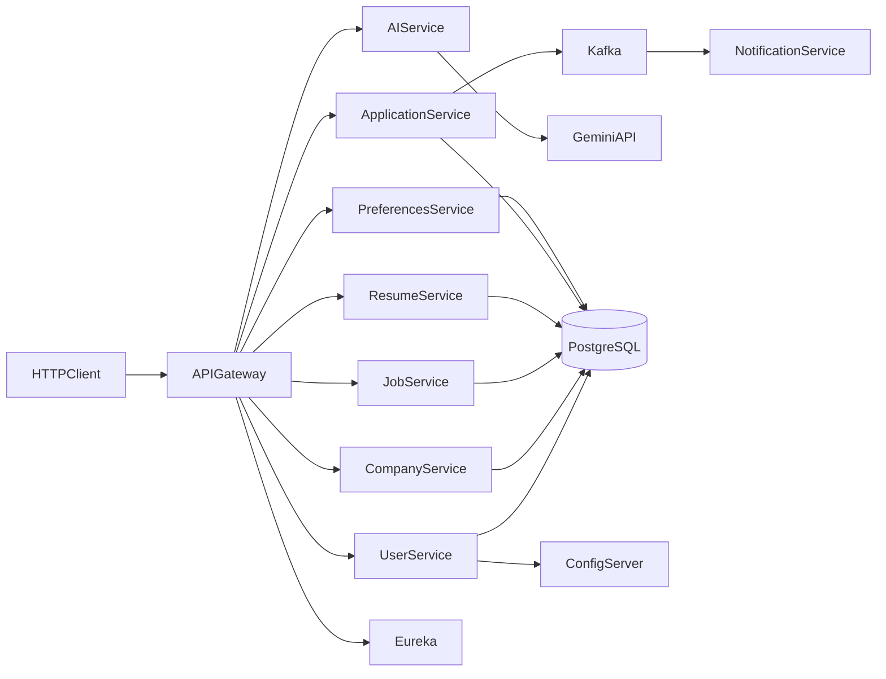

# JobMate Backend

JobMate is a **backend-only** job-marketplace API: identity, employer companies, job publishing, structured resumes, applications, saved jobs, Gemini-assisted content, and optional Kafka-driven email. It is a local portfolio system, not a production or Naukri-scale deployment. There is no frontend.

## Documentation

| Doc | Use |
|---|---|
| [Run modes](docs/RUN_MODES.md) | Canonical how to start (native IntelliJ, hybrid DBs, full Compose) |
| [Demo](docs/DEMO.md) | 15-minute walkthrough; `docs/http/demo.http` and Postman |
| [API notes](docs/API.md) | Gateway routes, auth, error codes |
| [Architecture](docs/ARCHITECTURE.md) | Boundaries, Feign, Kafka, AI |
| [Request flows](docs/FLOWS.md) | Signup, publishing, apply, review, search, saved jobs, admin |
| [Domain model](docs/DOMAIN.md) | Roles, states, ownership, invariants |
| [Decisions](docs/DECISIONS.md) | Why MVC gateway, DB-per-service, fail-open AI |
| [Limitations](docs/LIMITATIONS.md) | Non-goals and current gaps |
| [Portfolio](docs/PORTFOLIO.md) | Recruiter-facing summary |
| [Local development](docs/LOCAL_DEVELOPMENT.md) | Env files, DB ports, Config Server path |
| [Testing](docs/TESTING.md) | Existing coverage, commands, CI scope, gaps |
| [Security](docs/SECURITY.md) | JWT, header trust, secrets handling |
| [Contributing](CONTRIBUTING.md) | Ownership, identity headers, tests |

## Architecture

Six domain services each own a PostgreSQL database. Kafka and SMTP are optional (`docker compose --profile kafka`). Gemini is optional; apply still persists if screening fails.

## Modules

| Path | Responsibility |
|---|---|
| `cloud/job-portal-service-registry` | Eureka |
| `cloud/job-portal-config-server` | Native Spring Cloud Config Server (`job-portal-config/`) |
| `cloud/job-portal-api-gateway` | Spring MVC gateway: JWT verify, identity headers, path-based admin |
| `services/job-portal-user-service` | Signup, login, profiles, user administration |
| `services/job-portal-company-service` | Employer-owned company profiles |
| `services/job-portal-job-service` | Jobs, categories, skills, tags, filters, natural-language search |
| `services/job-portal-resume-service` | Structured resumes and nested sections |
| `services/job-portal-application-service` | Application lifecycle, notes, screening orchestration |
| `services/job-portal-preferences` | Saved jobs |
| `services/job-portal-ai-service` | Stateless Gemini adapter |
| `services/job-portal-notification-service` | Kafka consumer and SMTP |
| `common-lib` | Shared DTOs, enums, event contracts |
| `job-portal-config` | Sanitized local Config Server properties |
| `docker` | PostgreSQL, cloud, and service Compose definitions |

## Stack

- Java 21, Maven, Spring Boot 4.0.5, Spring Cloud 2025.1.1
- Spring MVC Gateway (not WebFlux), Eureka, native Config Server, OpenFeign
- Spring Security, BCrypt, JJWT
- Spring Data JPA, Hibernate (`ddl-auto: update`), six PostgreSQL databases (Compose uses Postgres 16)
- Optional Apache Kafka and JavaMail
- Google Gen AI SDK (Gemini)
- Docker Compose and Jib

## Prerequisites and configuration

- JDK 21, Maven 3.9+ (no wrapper at repo root; wrappers exist in executable modules)
- Docker Desktop for Compose databases (and optional Kafka)
- Runtime env: `JWT_SECRET` (≥ 32 bytes), `DB_PASSWORD`; optional `GEMINI_API_KEY`, `MAIL_HOST`, `MAIL_PORT`, `MAIL_USERNAME`, `MAIL_PASSWORD`

Copy `docker/.env.example` → `docker/.env`. Never commit `.env` files or secret values. Placeholders and Config Server layout: [Local development](docs/LOCAL_DEVELOPMENT.md).

## How to run and demo

Start instructions live in **[docs/RUN_MODES.md](docs/RUN_MODES.md)** (pick one mode; do not mix). Walkthrough: **[docs/DEMO.md](docs/DEMO.md)**.

Gateway: `http://localhost:5007` (host Java) or `http://localhost:5050` (full Compose). Eureka `8761`, Config Server `8888`.

## API highlights

Call the **gateway**. Use `Authorization: Bearer <token>` except `/auth/**`.

- `POST /auth/signup`, `POST /auth/login`
- `GET /api/users/profile`
- `POST /api/companies`, `GET /api/companies/my`
- `POST /api/jobs`, `GET /api/jobs`, `PATCH /api/jobs/{id}/publish`
- `POST /api/resumes` and nested resume sections
- `POST /api/applications` (fail-open Gemini screening); cover letter and skills-gap by application id
- `POST /api/jobs/search/natural`
- `POST /api/preferences/saved-jobs`
- Gemini helpers under `/api/ai`

See [API notes](docs/API.md). There is no generated OpenAPI spec; maintain `docs/http/gen_postman.mjs` / `JobMate.postman_collection.json` when routes change.

## Current status

Implemented for local evaluation:

- Eureka, native Config Server, user-service JWT issuance, and MVC gateway verification/header rewrite
- Database-per-service persistence; Hibernate `ddl-auto: update` (no Flyway/Liquibase)
- Feign between job, company, resume, user, application, and AI
- Optional Kafka `application.status.changed` + SMTP (`docker compose --profile kafka`)
- Gemini screening on apply, cover letter (fail-open), skills-gap, natural-language job search
- Gateway `ROLE_ADMIN` on listed admin routes; employer/admin taxonomy writes; application GET ownership
- Company update, resume nested GETs, and application notes check owner or employer
- Apply only to `OPEN` jobs; drafts omitted from public company job lists
- Login rejects `SUSPENDED` and `DELETED` accounts
- Unit tests for signup JWT roles, suspended login, job search filters, apply-time screening, draft-job apply rejection, plus context-load smoke tests
- Jib images and Compose infrastructure

Gaps and non-goals: [Limitations](docs/LIMITATIONS.md). In short: services trust identity headers on direct ports; no outbox; no frontend, refresh tokens, file parsing, search index, Kubernetes, or production deployment.

## Security

Secrets are environment variables only. Rotate JWT, database, SMTP, and Gemini credentials if older copies of this project were shared; removing them from the tree does not erase Git history.

Read [Security](docs/SECURITY.md) before exposing any port.

## License

No redistribution license has been granted. Source-available for portfolio review.
