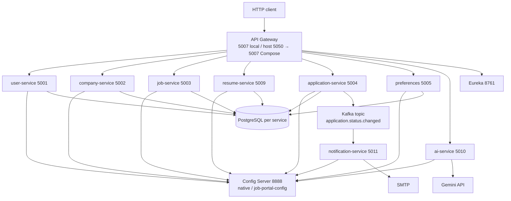
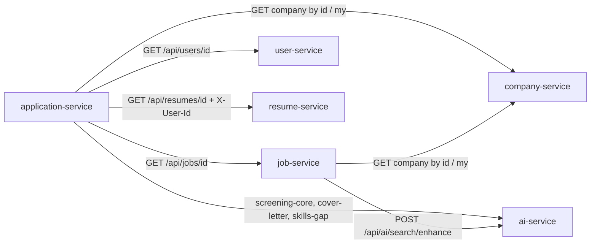

# Architecture

Deep reference for the JobMate backend as implemented. Run modes and ports: [RUN_MODES.md](RUN_MODES.md). HTTP surface: [API.md](API.md). Domain states: [DOMAIN.md](DOMAIN.md). Request sequences: [FLOWS.md](FLOWS.md). Identity model: [SECURITY.md](SECURITY.md). Decisions: [DECISIONS.md](DECISIONS.md).

## Scope and portfolio limits

JobMate models a local evaluation path from signup through an employer application decision. It is a **portfolio system**, not a production marketplace.

Out of scope (not implemented):

- Frontend, generated OpenAPI, `/v1` versioning, pagination
- Recruiter resume search, payments, public SEO pages
- Resume PDF/DOC upload or parsing
- Search index, ranking, or job-alert product (`/api/ai/alert-suggestion` was removed)
- Refresh tokens, revocation, OAuth2/OIDC, mTLS between services
- Versioned DB migrations (`ddl-auto: update` in Config Server YAML)
- Atomic outbox for notifications

Direct service ports exist for local debugging. Only the API Gateway is the public HTTP boundary.

## Runtime



| Component | Process port | Host exposure |
|---|---|---|
| Eureka (`job-portal-service-registry`) | 8761 | 8761 |
| Config Server (`job-portal-config-server`) | 8888 | 8888 |
| API Gateway | 5007 | **5007** native/hybrid IntelliJ; **5050→5007** full Compose |
| user-service | 5001 | 5001 |
| company-service | 5002 | 5002 |
| job-service | 5003 | 5003 |
| application-service | 5004 | 5004 |
| preferences | 5005 | 5005 |
| resume-service | 5009 | 5009 |
| ai-service | 5010 | 5010 |
| notification-service | 5011 | 5011 (not a gateway route) |

Notification-service is a Kafka consumer. It is not routed by the gateway.

## Public boundary

The gateway (`cloud/job-portal-api-gateway`) is the only intended client entry:

- `/auth/**` → user-service, no JWT
- `/api/**` → JWT required (`Authorization: Bearer …`); invalid or missing token → 401
- After HMAC verification, the gateway **strips** caller `X-User-Id`, `X-User-Email`, `X-User-Role` and **sets** them from JWT claims `userId`, `email`, `authorities`
- Extra path filters: `ROLE_ADMIN` on selected admin routes; `ROLE_ADMIN` or `ROLE_EMPLOYER` on job taxonomy writes (see [FLOWS.md](FLOWS.md#7-admin-through-the-gateway-vs-direct-ports))

Downstream controllers trust those headers. Calling `localhost:5001`–`5010` skips JWT and gateway role checks.

## Data ownership

Each persistent service has its own PostgreSQL database. There are no cross-database FKs. Rows store foreign **IDs**; views are assembled over Feign.

| Service | Database (Compose / JDBC name) | Owned data |
|---|---|---|
| user-service | `job_portal_user` | Users, BCrypt password, `UserRole`, `UserStatus`, last login / suspend / delete timestamps |
| company-service | `job_portal_company` | Companies, social links, `ownerId`, verify flags |
| job-service | `job_portal_job` | Jobs, categories, skills, tags; job stores `companyId` + `employerId` |
| resume-service | `job_portal_resume` | Resumes and nested personal info, experience, education, projects, skills, languages; `candidateId` |
| application-service | `job_portal_application` | Applications and employer notes; IDs for candidate, employer, company, job, resume |
| preferences | `job_portal_preference` | Saved jobs (`candidateId`, `jobId` only) |
| ai-service | none | Stateless Gemini adapter |
| notification-service | none | Kafka → SMTP; no domain rows |

Shared request/response and event types live in `common-lib` (including `com.sameer.job.dto.ai` and `ApplicationStatusChangedEvent`).

## Feign graph

OpenFeign clients resolve Eureka names (`JOB-PORTAL-*-SERVICE`). AI Feign on application-service and job-service: connect 5s, **read 15s**.



Callers:

- **job-service → company-service:** resolve employer company on create (`GET /api/companies/my` with `X-User-Id`); attach company on job responses (`GET /api/companies/{id}`).
- **job-service → ai-service:** natural-language search enhancement only.
- **application-service → job, resume, company, user, AI:** apply, hydrate responses, screening, cover letter, skills-gap, Kafka payload enrichment.

Preferences does **not** call job-service (saved `jobId` is not validated). AI does not call other services.

## AI fail-open vs fail-closed

| Path | Gemini / Feign failure |
|---|---|
| Apply screening (`applyScreening`) | Fail-open: application row is kept; `aiScore` null; `aiShortListStatus` = `NOT_SCREENED` |
| `POST /api/jobs/search/natural` | Fail-open: treat query as `JobSearchRequest.keyword` and run structured `GET /api/jobs` filters (default status `OPEN`, `active=true`) |
| `POST /api/applications/{id}/cover-letter` | Fail-open: log error; **return stored application** (cover letter unchanged; no persist of generated text) |
| `GET /api/applications/{id}/skills-gap` | **Propagates** the AI error (typically `AI_UNAVAILABLE` / 503). Does not fail open. |

Direct `/api/ai/**` calls are not wrapped by those domain catch blocks; they surface Gemini failures from ai-service.

## Kafka: `application.status.changed`

Employer `PATCH /api/applications/{id}/status` saves the new `ApplicationStatus`, then `ApplicationEventPublisher` sends `ApplicationStatusChangedEvent` to topic **`application.status.changed`**.

If a Spring transaction is active, publish is registered as **`afterCommit`**. `ApplicationServiceImpl.updateStatus` is **not** `@Transactional`, so in the current path publish runs immediately after `save`. Either way:

- DB write and Kafka send are **not** one transaction (no outbox).
- Kafka send failures are logged and swallowed; the status row stays saved.
- `NotificationKafkaConsumer` (group `notification-service`) calls JavaMail HTML SMTP. SMTP failure does not roll back the application row.

Candidate withdraw does **not** publish this event.

## Configuration topology

Config Server (`spring.profiles.active: native`) serves files from `job-portal-config/` named after each `spring.application.name` (for example `job-portal-user-service.yaml`).

Search locations (`cloud/job-portal-config-server`):

```text
${CONFIG_REPOSITORY_PATH:file:../../job-portal-config,file:./job-portal-config,file:./job-portal-system/job-portal-config}
```

- Host: set working directory to repo root, or override `CONFIG_REPOSITORY_PATH`.
- Compose: mounts `job-portal-config` **read-only** at `/config`; `CONFIG_REPOSITORY_PATH=file:/config`.

Datasource **host and port are not defaulted** in those YAML files (`jdbc:postgresql://${DB_HOST}:${*_DB_PORT}/…`). Host-run services need `DB_HOST` and `*_DB_PORT` ([`docker/local-native.env.example`](../docker/local-native.env.example), [`docker/local-hybrid.env.example`](../docker/local-hybrid.env.example)). Container-run services override JDBC with `SPRING_DATASOURCE_URL` (`userdb:5432`, `companydb:5432`, …).

JWT HMAC secret is `JWT_SECRET` (min 32 bytes) on user-service and gateway. Gemini: `GEMINI_API_KEY` on ai-service.

## AI boundary

ai-service is a **stateless Gemini adapter** (no domain database). Application-service and job-service assemble prompts from their Feign reads and call AI; AI still does not own user, job, resume, or application rows. Gemini model settings are in ai-service `application.yaml` (`gemini-3.5-flash-lite` at time of writing).
