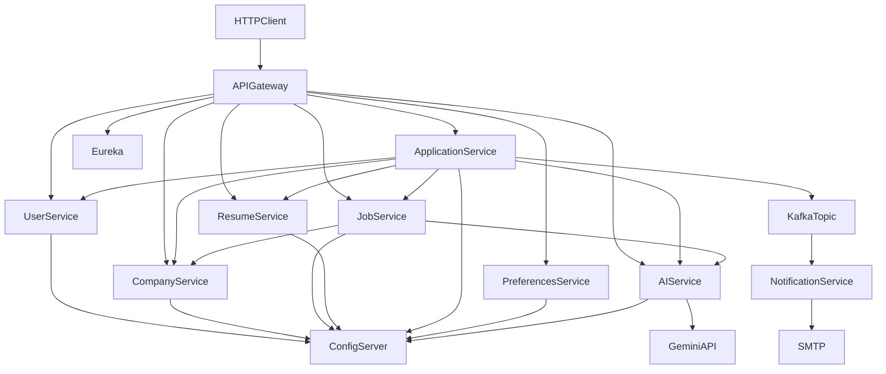

# Architecture

## Scope

JobMate models the backend workflow from account creation to an employer's application decision. It is not a full job marketplace: recruiter resume search, payments, public SEO pages, file parsing, and large-scale search ranking are outside the current scope.

## Runtime components

The API Gateway is the public boundary. It validates an HMAC-signed JWT issued by user-service and derives identity headers for downstream services. Direct service ports exist for local debugging and must not be exposed in a production network.

## Data ownership

| Service | Owned data |
|---|---|
| user-service | Users, credentials, roles, account status |
| company-service | Companies and social links |
| job-service | Jobs, categories, skills, and tags |
| resume-service | Resumes, personal details, experience, education, projects, skills, languages |
| application-service | Applications and employer notes |
| preferences | Saved jobs |
| AI and notification | Stateless |

Services store foreign identifiers rather than cross-database relationships. For example, an application stores candidate, employer, company, job, and resume IDs, then resolves views through Feign clients.

## Synchronous collaboration

- job-service calls company-service to resolve the employer's company.
- application-service calls user, company, job, resume, and AI services.
- job-service calls AI for natural-language search interpretation.
- Eureka service names are used by OpenFeign and the gateway load balancer.

Application screening and natural-language search fail open if Gemini is unavailable. Cover-letter and skills-gap requests surface the AI error. Feign read timeout for AI is 15 seconds.

## Asynchronous collaboration

`ApplicationEventPublisher` sends `ApplicationStatusChangedEvent` to `application.status.changed`. `NotificationKafkaConsumer` consumes it and sends an HTML email with JavaMail.

The database update and Kafka publish are not atomic. An outbox would be appropriate if notification delivery became a strict business requirement.

## Configuration

The Config Server uses the native backend and reads `job-portal-config/`. Docker mounts that directory read-only at `/config`; host execution can override `CONFIG_REPOSITORY_PATH`.

Datasource host and port are not defaults in Config Server. Host-run services supply `DB_HOST` and `*_DB_PORT` (see `docker/local-native.env.example` and `docker/local-hybrid.env.example`). Container-run services override the JDBC URL with Docker service names via `SPRING_DATASOURCE_URL`.

## AI boundary

AI service is a stateless Gemini adapter. Shared request/response types live in `common-lib` (`com.sameer.job.dto.ai`). Application-service and job-service assemble domain context and call AI over Feign; AI still does not own user, job, resume, or application rows.
