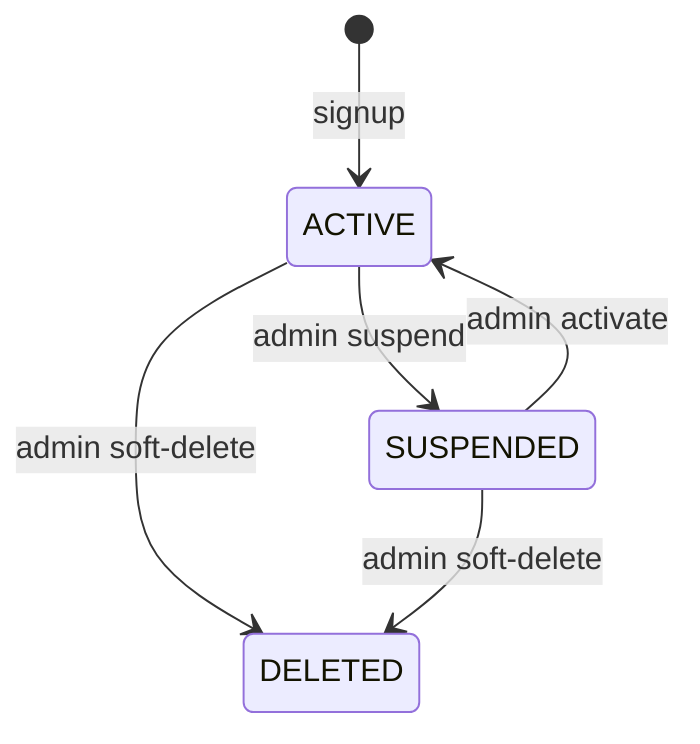
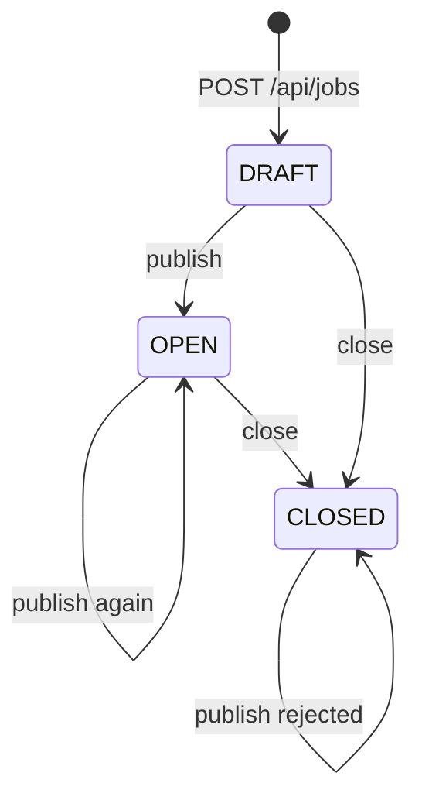
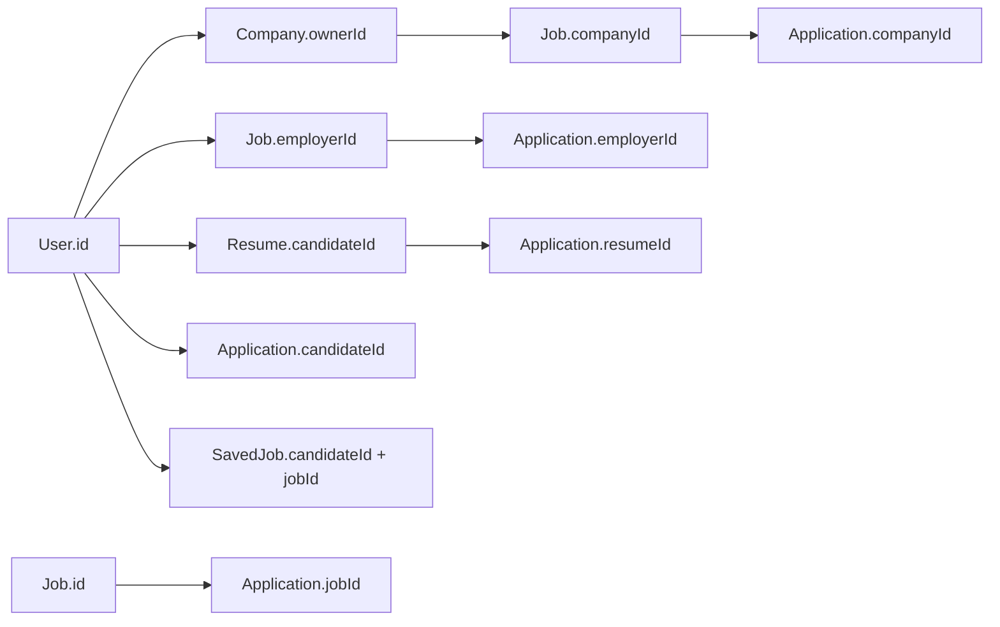

# Domain

Enums and ownership as **implemented**. HTTP verbs: [API.md](API.md). How they move: [FLOWS.md](FLOWS.md). Types live in `common-lib` (`com.sameer.job.domain`).

**Gap** means the value or rule exists in code or schema but is unused, unenforced, or weaker than the name suggests.

---

## Roles (`UserRole`)

| Value | How it is obtained | What it gates |
|---|---|---|
| `ROLE_JOB_SEEKER` | Signup (entity default if unset) | No extra gateway role filter; services use `X-User-Id` as candidate |
| `ROLE_EMPLOYER` | Signup | Same header model for company/job/application employer ids; gateway taxonomy writes |
| `ROLE_ADMIN` | **Cannot** self-register (`ADMIN_SELF_SIGNUP`). Must be present on a user row | Gateway-only on listed admin paths; job DRAFT visibility if `X-User-Role` contains `ROLE_ADMIN` |

Services generally do **not** check that the caller’s role matches the action (a seeker token can still `POST /api/jobs` if the gateway allows `/api/jobs/**` and `X-User-Id` is used as `employerId`). **Gap:** role is not a service-level invariant except where a controller compares ids.

---

## User status (`UserStatus`)

| Value | Assigned by | Login / password |
|---|---|---|
| `ACTIVE` | Signup; admin activate (clears `suspendedAt`) | Allowed |
| `SUSPENDED` | Admin suspend (`suspendedAt` set) | **Rejected** `ACCOUNT_DISABLED` (login, forgot-token issue, reset, change-password) |
| `DELETED` | Admin `delete` (`deletedAt` set; row kept) | **Rejected** `ACCOUNT_DISABLED` (same as suspend; forgot-password still returns the generic message) |
| `INACTIVE` | **Never assigned** in user-service | **Not rejected** — if a row were `INACTIVE`, login, reset, and change-password would succeed |

**Gaps:** no login check for `INACTIVE`; JWT is not revoked on suspend (token valid until expiry); deleted users remain in the users table.

---

## Company (`CompanyStatus` and ownership)

**Owned data:** company row + social links. **Ownership id:** `ownerId` (unique: one company per user). Also unique `name`, optional unique `registrationNumber`, generated `slug`.

| Value | Assigned by | Notes |
|---|---|---|
| `ACTIVE` | Admin `PATCH .../verify` (also `verified=true`) | |
| `SUSPENDED` | Admin `PATCH .../deactivate` (`verified=false`) | |
| `PENDING_VERIFICATION` | **Unused** | Never set in `CompanyServiceImpl` |
| `REJECTED` | **Unused** | Never set |

**Gaps:**

- `createCompany` does not set `status` (typically **null** until verify/deactivate).
- Job create only requires `GET /api/companies/my` for that owner — **not** `ACTIVE` or `verified`.
- Suspended company does not block job publish or apply.

---

## Job (`JobStatus` and ownership)

**Owned data:** job, category, skill, tag catalog; embeddable location and salary. **Ids:** `employerId`, `companyId` (copied from employer’s company at create; not updated if company changes).

| Value | Assigned by | Listing / apply |
|---|---|---|
| `DRAFT` | Create default | Hidden from public `GET` by id (404) unless employer or admin role header; company list excludes; apply → `JOB_NOT_OPEN` |
| `OPEN` | Publish | Default `GET /api/jobs` and company list; apply allowed |
| `CLOSED` | Close (`active=false`) | Apply `JOB_NOT_OPEN`; publish **conflict** |
| `EXPIRED` | **Never assigned** | Publish would conflict **if** a row were `EXPIRED`; `expiresAt` is stored only |
| `FILLED` | **Never assigned** | No auto-fill when openings are taken |

**Gaps:** no job that `expiresAt` has passed is flipped to `EXPIRED`; `opening` is not decremented on apply; `JobSpecification` does not filter tags/skills (TODO); close is allowed from DRAFT.

---

## Application (`ApplicationStatus`, `AiShortListStatus`)

**Owned data:** application row, notes (`addedByUserId`, content). **Foreign ids:** `candidateId`, `employerId`, `companyId`, `jobId`, `resumeId` (company/employer taken from job at apply time).

### Lifecycle status

| Value | Assigned by | Extra rules |
|---|---|---|
| `PENDING` | Apply | Default |
| `REVIEWING`, `SHORTLISTED`, `INTERVIEW_SCHEDULED`, `REJECTED`, `HIRED` | Employer `PATCH .../status` | No transition matrix — any of these can be set from a non-withdrawn row |
| `WITHDRAWN` | Candidate withdraw | Employer cannot status-change afterward; withdraw does not emit Kafka |

**Gap:** employer can set `WITHDRAWN` via status API if the row is not already withdrawn. Kafka email templates exist for every status including `WITHDRAWN`, but withdraw itself does not publish.

`appliedAt` and `withdrawnAt` fields exist but the current create/withdraw paths do not populate them. Employer notes are included when the full application response is built, so a candidate allowed to read that response can also see those notes even though the dedicated notes endpoints are employer-only.

### Screening band (`AiShortListStatus`)

Set only in `applyScreening` / mapper:

| Value | When |
|---|---|
| `NOT_SCREENED` | Initial map; **Gemini/Feign failure** |
| `AUTO_SHORTLISTED` | score `>= 80` |
| `REVIEW_RECOMMENDED` | score `>= 50` and `< 80` |
| `LOW_MATCH` | score `< 50` |
| `PENDING_REVIEW` | **Unused** — never assigned |

`aiScore` is nullable. Employer filter `minAiScore` uses `>=` on that column.

Cover letter text is an application field; generation fail-open leaves it unchanged. Skills-gap is **not** stored (computed via AI).

---

## Resume (ownership and unused-ish enums)

**Owned data:** resume + nested collections. **Id:** `candidateId`. Nested GET/write and apply-time Feign GET require that id as `X-User-Id`.

Stored but **not used for access control:** `ResumeVisibility` (`PUBLIC`, `PRIVATE`, `LINK_ONLY`), `ResumeTemplate` (persisted/default `PROFESSIONAL` only). **Gap:** visibility does not hide a resume from its owner check; there is no public resume URL.

No file blob. `completionScore` is stored; scoring logic is not a hiring invariant.

---

## Preferences

**Owned data:** `saved_jobs` (`candidateId`, `jobId`, `savedAt`). Duplicate pair → conflict. **Gap:** `jobId` is not proven to exist or be `OPEN`.

---

## AI (stateless)

AI owns **no** domain aggregates. Prompt DTOs in `common-lib`. Screening/cover-letter/skills-gap/search behavior: [ARCHITECTURE.md](ARCHITECTURE.md#ai-fail-open-vs-fail-closed).

---

## Ownership ID map

Hydration (application responses, Kafka payload) **re-reads** current user/job/company over Feign. Stale names are possible if those rows change; ids on the application row do not update.

---

## Enforced invariants

- Database uniqueness covers user email, company owner, and company name. Service-level prechecks reject duplicate saved `(candidateId, jobId)` and duplicate apply `(candidateId, jobId)`.
- Apply only if job `status == OPEN`.
- Resume GET for apply must be the candidate’s resume (resume-service owner check).
- Application GET by id: candidate **or** employer on that row. Company application list: caller’s company. Notes: application `employerId`.
- Job mutate/publish/close/delete: `job.employerId` equals header.
- Company update/delete: `ownerId` equals header.
- Gateway JWT + admin/taxonomy role filters (not on direct ports).
- Login blocks `SUSPENDED` and `DELETED` only.

---

## Missing or weak invariants

- Header-trusting services; Feign can present `X-User-Id` (application-service skills-gap loads the resume as the **candidate**, not the employer).
- No check that `ROLE_EMPLOYER` owns company/job writes or that `ROLE_JOB_SEEKER` is the only applicant.
- Saved-job and application duplicate checks have no matching database unique constraint, so concurrent requests can race.
- Company verification / `ACTIVE` not required for jobs.
- `UserStatus.INACTIVE`, `CompanyStatus.PENDING_VERIFICATION` / `REJECTED`, `JobStatus.EXPIRED` / `FILLED`, `AiShortListStatus.PENDING_REVIEW` unused or unenforced as named.
- No application status state machine; no decrement of `opening`; no expiry job.
- Kafka/SMTP not atomic with status (and withdraw is silent).
- Saved jobs and job filters (skills/tags) do not enforce marketplace consistency.
- `GET /api/users/{userId}` is callable by any authenticated gateway client (needed for Feign hydration).
