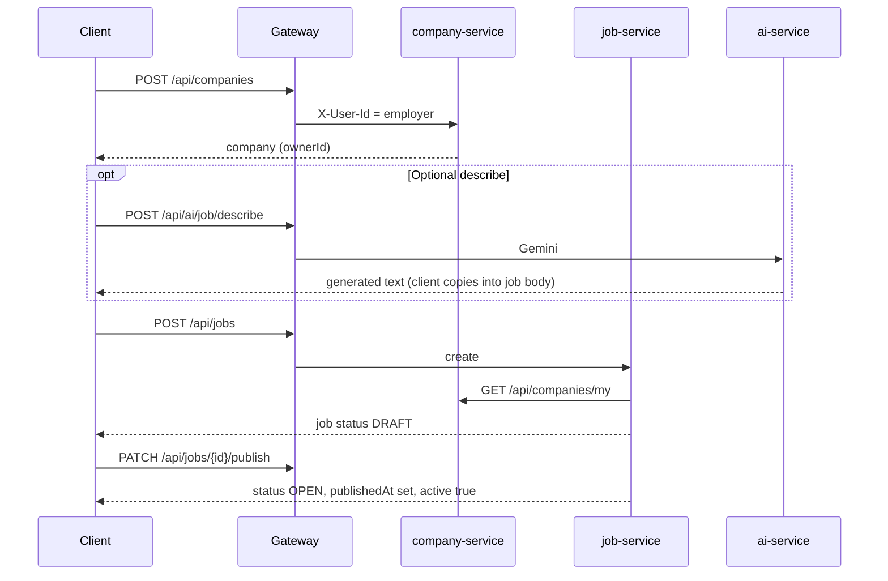
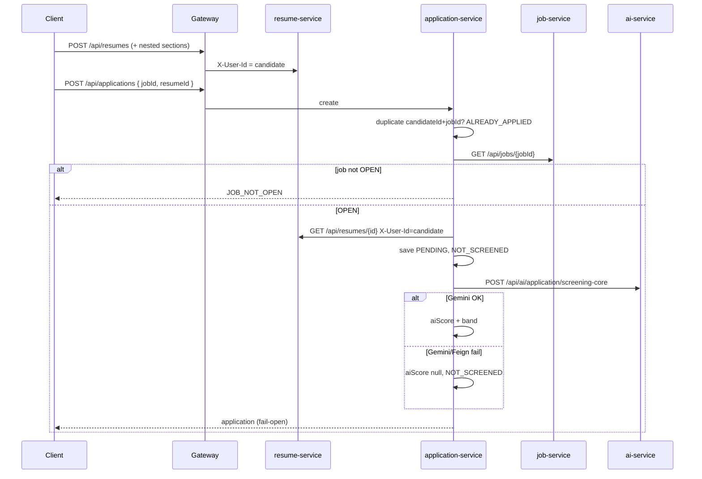
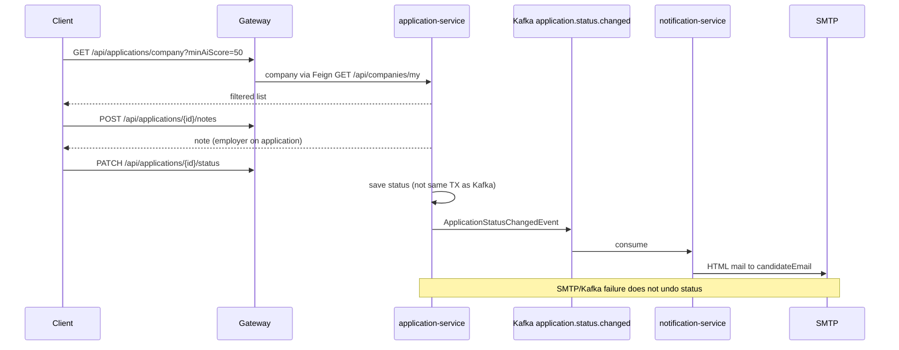
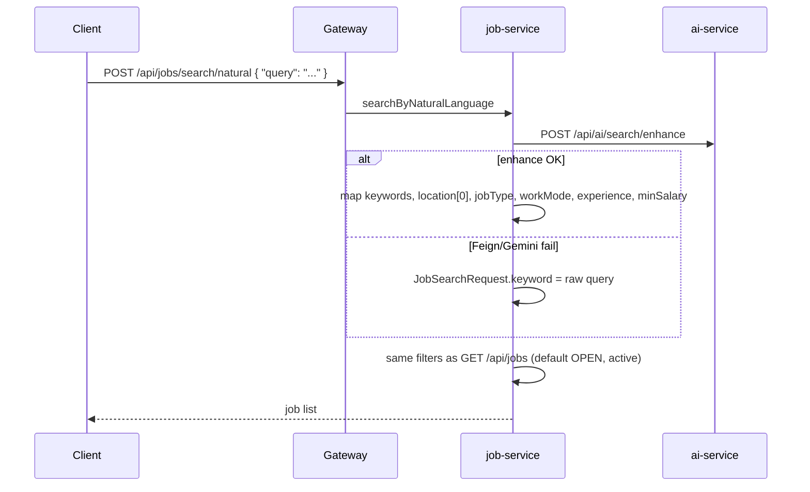
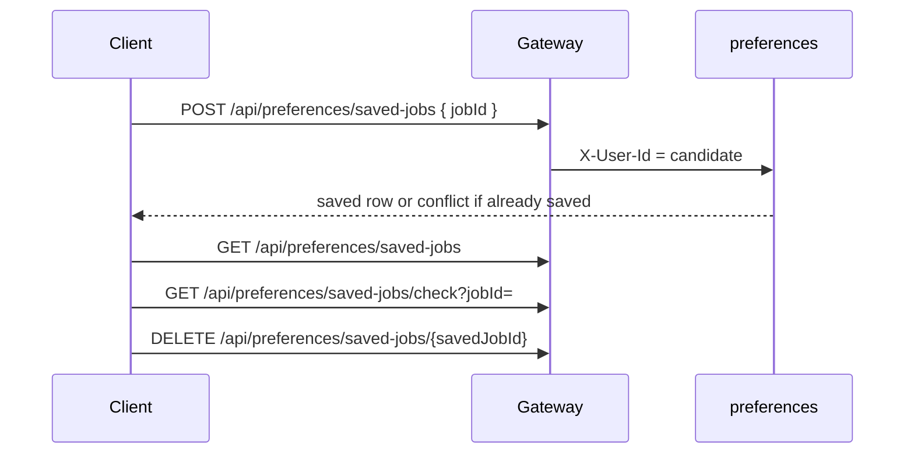
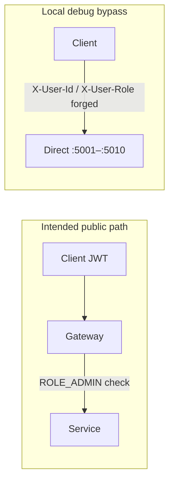

# Flows

Implemented request paths. Endpoint tables: [API.md](API.md). States: [DOMAIN.md](DOMAIN.md). Gateway vs ports: [ARCHITECTURE.md](ARCHITECTURE.md), [SECURITY.md](SECURITY.md). Click-through: [DEMO.md](DEMO.md).

Unless noted, clients call the **gateway** (`http://localhost:5007` native/hybrid, `http://localhost:5050` full Compose) with `Authorization: Bearer <jwt>` on `/api/**`.

---

## 1. Signup, login, JWT, gateway headers

```mermaid
sequenceDiagram
  participant C as Client
  participant G as Gateway
  participant U as user-service

  C->>G: POST /auth/signup or /auth/login
  G->>U: lb job-portal-user-service (no JWT)
  U-->>C: jwt + user (via G)

  C->>G: GET /api/... Authorization Bearer jwt
  G->>G: Verify HMAC JWT; strip X-User-*; set from claims
  G->>U: Forward with X-User-Id, X-User-Email, X-User-Role
```

1. `POST /auth/signup`: unique email; password ≥ 8 characters; `UserRole` must not be `ROLE_ADMIN` (`ADMIN_SELF_SIGNUP`). New user `UserStatus.ACTIVE`. JWT includes claims `email`, `authorities` (role name), `userId`. TTL 24 hours. HMAC-SHA from `JWT_SECRET`.
2. `POST /auth/login`: unknown email or bad password → `INVALID_CREDENTIALS`. `SUSPENDED` or `DELETED` → `ACCOUNT_DISABLED`. **`INACTIVE` is not rejected** (see [DOMAIN.md](DOMAIN.md)). `lastLogin` updated on success; new JWT issued.
3. `POST /auth/forgot-password`: generic success for unknown/disabled emails (no token). Eligible users get a cryptographically random opaque token; only the SHA-256 hash is stored, one-hour expiry, single-use. No email/SMTP. Local/demo may return `resetToken` when `app.password-reset.expose-token` is true (default).
4. `POST /auth/reset-password`: hashes the submitted token, encodes the new password, clears the stored hash. `INVALID_RESET_TOKEN` / `RESET_TOKEN_EXPIRED` / `ACCOUNT_DISABLED`.
5. `POST /api/users/change-password` (JWT): verifies current password (`INVALID_CREDENTIALS`), encodes the new password, clears any pending reset token. Suspended/deleted → `ACCOUNT_DISABLED`.
6. Gateway `/auth/**` is public. `GET /api/jobs`, `GET /api/jobs/{numeric id}`, and taxonomy GET list/detail allow anonymous access; a supplied Bearer token is validated (invalid → 401) and identity is injected. Other `/api/**` routes require `Authorization: Bearer `; missing/invalid/expired → 401.
7. Gateway replaces identity headers from the token. Forged `X-User-*` on a **gateway** request are ignored. Direct service ports still accept those headers.

---

## 2. Employer company, DRAFT job, optional AI describe, publish



1. Employer creates a company. **One company per `ownerId`**. Duplicate name / registration number → conflict. Create does **not** set `CompanyStatus` (often null until verify/deactivate). **Verified is not required** to post jobs.
2. Optional: `POST /api/ai/job/describe` (and sibling job-assist routes). Job create does **not** call AI itself.
3. `POST /api/jobs`: job-service loads the employer company via Feign, persists **`DRAFT`**, `active=true`, `employerId` from header, `companyId` from that company.
4. Listing visibility:
   - `GET /api/jobs` (and NL search after mapping): default filter **`status=OPEN` and `active=true`**. Passing `status` can list other statuses if `active` is still true.
   - `GET /api/jobs/company/{companyId}`: **OPEN only**.
   - `GET /api/jobs/{id}`: DRAFT returns **404** unless the caller is the employer (`X-User-Id`) or `X-User-Role` contains `ROLE_ADMIN` (gateway optional JWT).
   - `GET /api/jobs/my`: every status for the JWT employer id, newest first (gateway `ROLE_EMPLOYER`).
   - `GET /api/jobs/admin`: all jobs (gateway requires `ROLE_ADMIN`).
5. `PATCH /api/jobs/{id}/publish` (employer on the row): sets `OPEN`, `publishedAt`, `active=true`. **Conflict** if current status is `CLOSED` or `EXPIRED`. Re-publish of an already `OPEN` job is allowed. `EXPIRED` / `FILLED` are not assigned by a scheduler (see [DOMAIN.md](DOMAIN.md)).
6. `PATCH .../close` sets `CLOSED`, `closedAt`, `active=false`.

---

## 3. Structured resume and apply



1. Resume is a **structured record** (no file upload). Nested education, experience, projects, skills, languages. GET/write nested resources require resume **owner** `X-User-Id`. Apply Feign uses the **candidate** id as that header.
2. `POST /api/applications`:
   - Duplicate `(candidateId, jobId)` → `ALREADY_APPLIED`.
   - Job via Feign; if `status != OPEN` → `JOB_NOT_OPEN` (includes DRAFT/CLOSED).
   - Copies `companyId` and `employerId` from the job response (not from the client body).
   - Initial status `PENDING`. Screening runs after first save.
3. Score bands (integer `score` from Gemini, implemented in `AiPromptAssembler.shortListStatus`):
   - `>= 80` → `AUTO_SHORTLISTED`
   - `>= 50` → `REVIEW_RECOMMENDED`
   - else → `LOW_MATCH`
4. Gemini/Feign failure: **`NOT_SCREENED`**, `aiScore` null; HTTP still 201. `PENDING_REVIEW` is never assigned by this mapper.
5. Cover letter: `POST /api/applications/{id}/cover-letter` (candidate). On AI failure, **returns stored application** (fail-open). Skills-gap: `GET .../skills-gap` (candidate or employer on the row) **propagates** AI errors.

---

## 4. Employer review, notes, status, Kafka, SMTP



1. `GET /api/applications/company`: employer’s company from `GET /api/companies/my`. Filters: `jobId`, `status`, `isStarred`, `aiShortListStatus`, **`minAiScore`** (`aiScore >=`). Sort: `AI_SCORE_DESC` / `AI_SCORE_ASC` (nulls last) or `appliedAt` desc.
2. Notes: `/api/applications/{id}/notes` — employer on that application (`employerId`). Stored on application-service.
3. `PATCH .../status`: employer only; **cannot** change a `WITHDRAWN` row. No other transition graph (any remaining enum value is accepted). Then Kafka as in [ARCHITECTURE.md](ARCHITECTURE.md#kafka-applicationstatuschanged).
4. **Not atomic:** status commit vs Kafka vs SMTP. Status is saved even if Kafka or mail fails. Publisher uses `afterCommit` only when a transaction is actually active; current `updateStatus` publishes right after save.
5. Withdraw (`PATCH .../withdraw`) sets `WITHDRAWN` and reason; **no** Kafka event.

---

## 5. Natural-language search and fallback



Fail-open: a down Gemini still returns a keyword listing. Mapping ignores unparseable enum strings. Tag/skill filters on `JobSpecification` are **not implemented** (TODO in code). Only the **first** location from the AI response is used.

---

## 6. Saved jobs



Stores `candidateId` + `jobId` only. **Does not** Feign job-service: a nonexistent or DRAFT `jobId` can be saved. Unsave is owner-checked by `savedJobId`. No job-alert fan-out.

---

## 7. Admin through the gateway vs direct ports

Gateway extra filters (JWT already applied) in `RouteConfig`:

| Gateway path | Required role |
|---|---|
| `GET /api/users`, `PATCH /api/users/*/suspend`, `PATCH /api/users/*/activate`, `DELETE /api/users/*/delete` | `ROLE_ADMIN` |
| `PATCH /api/companies/*/verify`, `PATCH /api/companies/*/deactivate` | `ROLE_ADMIN` |
| `GET /api/jobs/admin` | `ROLE_ADMIN` |
| `GET /api/jobs/my` | `ROLE_EMPLOYER` |
| POST/PUT/DELETE `/api/job-categories`, `/api/job-skills`, `/api/job-tags` | `ROLE_ADMIN` **or** `ROLE_EMPLOYER` |



`requireAnyRole` uses `String.contains` on header `X-User-Role`. User-service admin methods themselves do **not** re-check `ROLE_ADMIN`. Hitting `http://localhost:5001/api/users` (and analogous company/job admin URLs) **skips** the gateway role filter.

Self-signup cannot mint `ROLE_ADMIN`; an admin user must already exist in the database (no bootstrap endpoint in-repo).
